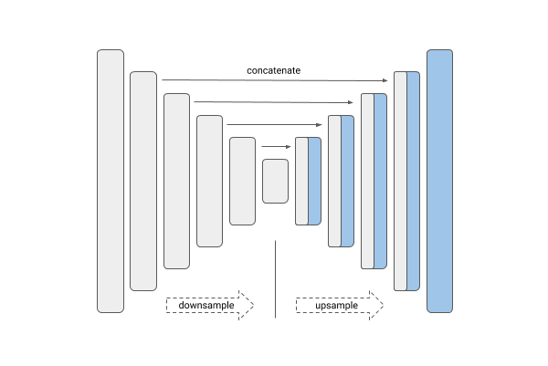
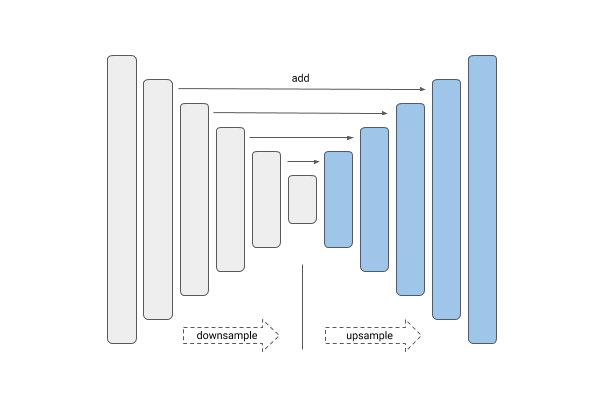
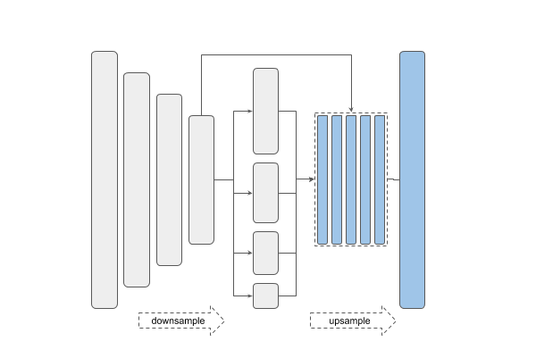
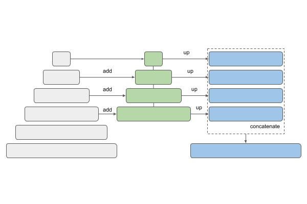

###########
Quick start
###########

Since the library is built on the Keras framework, created segmentation model is just a
Keras Model, which can be created as easy as:

.. code:: python

    from segmodels_keras import Unet

    model = Unet()

Depending on the task, you can change the network architecture by choosing backbones
with fewer or more parameters and use pretrainded weights to initialize it:

.. code:: python

    model = Unet('resnet50', encoder_weights='imagenet')

Change number of output classes in the model:

.. code:: python

    model = Unet('resnet50', classes=3, activation='softmax')

Change input shape of the model:

.. code:: python

    model = Unet('resnet50', input_shape=(None, None, 6), encoder_weights=None)

************************
Simple training pipeline
************************

.. code:: python

   from segmodels_keras import Unet
   from segmodels_keras import get_preprocessing
   from segmodels_keras.losses import bce_jaccard_loss
   from segmodels_keras.metrics import iou_score

   BACKBONE = 'resnet50'
   preprocess_input = get_preprocessing(BACKBONE)

   # load your data
   x_train, y_train, x_val, y_val = load_data(...)

   # preprocess input
   x_train = preprocess_input(x_train)
   x_val = preprocess_input(x_val)

   # define model
   model = Unet(BACKBONE, encoder_weights='imagenet')
   model.compile('Adam', loss=bce_jaccard_loss, metrics=[iou_score])

   # fit model
   model.fit(
       x=x_train,
       y=y_train,
       batch_size=16,
       epochs=100,
       validation_data=(x_val, y_val),
   )

********************
Models and Backbones
********************

**Models**

-  `Unet <https://arxiv.org/abs/1505.04597>`__
-  `FPN <http://presentations.cocodataset.org/COCO17-Stuff-FAIR.pdf>`__
-  `Linknet <https://arxiv.org/abs/1707.03718>`__
-  `PSPNet <https://arxiv.org/abs/1612.01105>`__

============= ==============
Unet          Linknet
============= ==============
|unet_image|  |linknet_image|
============= ==============
============= ==============
PSPNet        FPN
============= ==============
|psp_image|   |fpn_image|
============= ==============

.. _Unet: https://github.com/orthoseg/segmodels_keras/blob/main/LICENSE
.. _Linknet: https://arxiv.org/abs/1707.03718
.. _PSPNet: https://arxiv.org/abs/1612.01105
.. _FPN: http://presentations.cocodataset.org/COCO17-Stuff-FAIR.pdf

**Backbones**

==============  ===== 
Type            Names
==============  =====
VGG             ``'vgg16' 'vgg19'``
ResNet          ``'resnet50' 'resnet101' 'resnet152'``
ResNetV2        ``'resnet50v2' 'resnet101v2' 'resnet152v2'``
DenseNet        ``'densenet121' 'densenet169' 'densenet201'`` 
Inception       ``'inceptionv3' 'inceptionresnetv2'``
MobileNet       ``'mobilenet' 'mobilenetv2'``
EfficientNet    ``'efficientnetb0' 'efficientnetb1' 'efficientnetb2' 'efficientnetb3' 'efficientnetb4' 'efficientnetb5' 'efficientnetb6' 'efficientnetb7'``
EfficientNetV2  ``'efficientnetv2m'``    
==============  =====

.. epigraph::
    All backbones have weights trained on 2012 ILSVRC ImageNet dataset
    (``encoder_weights='imagenet'``).

***********
Fine tuning
***********

Some times, it is useful to train only randomly initialized
*decoder* in order not to damage weights of properly trained
*encoder* with huge gradients during first steps of training.
In this case, all you need is just pass ``encoder_freeze = True`` argument
while initializing the model.

.. code-block:: python

    from segmodels_keras import Unet
    from segmodels_keras.utils import set_trainable

    model = Unet(backbone_name='resnet50', encoder_weights='imagenet', encoder_freeze=True)
    model.compile('Adam', 'binary_crossentropy', ['binary_accuracy'])

    # pretrain model decoder
    model.fit(x, y, epochs=2)

    # release all layers for training
    set_trainable(model) # set all layers trainable and recompile model

    # continue training
    model.fit(x, y, epochs=100)

**************************
Training with non-RGB data
**************************

In case you have non RGB images (e.g. grayscale or some medical/remote sensing data)
you have few different options:

1. Train network from scratch with randomly initialized weights

.. code-block:: python

    from segmodels_keras import Unet

    # read/scale/preprocess data
    x, y = ...

    # define number of channels
    N = x.shape[-1]

    # define model
    model = Unet(backbone_name='resnet50', encoder_weights=None, input_shape=(None, None, N))

    # continue with usual steps: compile, fit, etc..

2. Add extra convolution layer to map ``N -> 3`` channels data and train with pretrained weights

.. code-block:: python

    from segmodels_keras import Unet
    from keras.layers import Input, Conv2D
    from keras.models import Model

    # read/scale/preprocess data
    x, y = ...

    # define number of channels
    N = x.shape[-1]

    base_model = Unet(backbone_name='resnet50', encoder_weights='imagenet')

    inp = Input(shape=(None, None, N))
    l1 = Conv2D(3, (1, 1))(inp) # map N channels data to 3 channels
    out = base_model(l1)

    model = Model(inp, out, name=base_model.name)

    # continue with usual steps: compile, fit, etc..

.. _Image Segmentation:
    https://en.wikipedia.org/wiki/Image_segmentation

.. _Tensorflow:
    https://www.tensorflow.org/

.. _Keras:
    https://keras.io

.. _Unet:
    https://arxiv.org/pdf/1505.04597

.. _Linknet:
    https://arxiv.org/pdf/1707.03718.pdf

.. _PSPNet:
    https://arxiv.org/pdf/1612.01105.pdf

.. _FPN:
    http://presentations.cocodataset.org/COCO17-Stuff-FAIR.pdf
